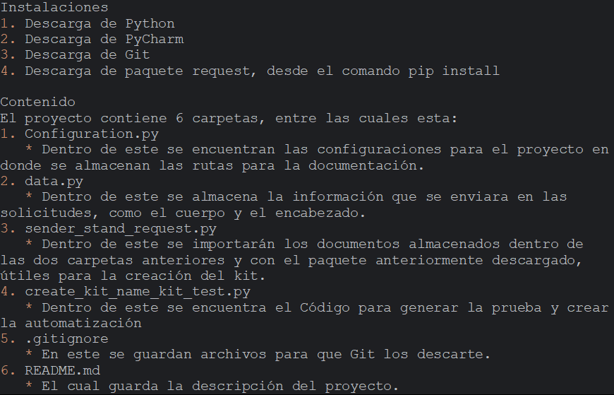

# Proyecto Urban Grocers 
Instalaciones 
1. Descarga de python
2. Descarga de PyCharm
3. Descarga de Git
4. Descarga de paquete request, desde el comando pip install

Contenido 
El proyecto contiene 6 carpetas, entre las cuales esta:
1. Configuration.py
   * Dentro de este se encuentran las configuraciones para el proyecto en donde se almacenan las rutas para la documentación.
2. data.py
   * Dentro de este se almacena la información que se enviara en las solicitudes, como el cuerpo y el encabezado.
3. sender_stand_request.py
   * Dentro de este se importarán los documentos almacenados dentro de las dos carpetas anteriores y con el paquete anteriormente descargado, útiles para la creación del kit.
4. create_kit_name_kit_test.py
   * Dentro de este se encuentra el código para generar el test y crear la automatización
5. .gitignore
   * En este se guardan archivos para que Git los descarte.
6. README.md
   * El cual guarda la descripción del proyecto.

